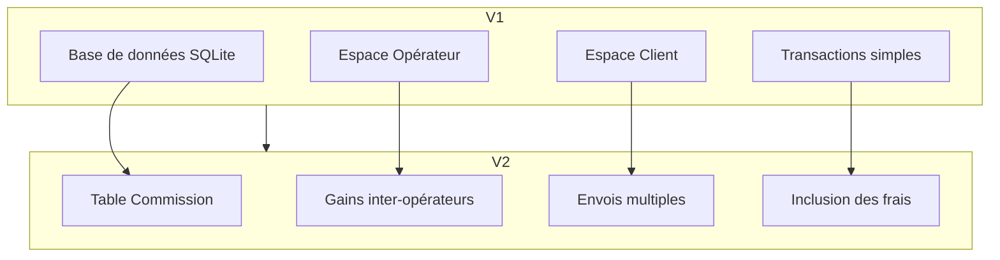

# Répartition des Tâches - Projet Mobile Money

**Date :** 20/07/2026 (Date de l'examen)
**Heure de début :** 08h00
**Heure de fin :** 17h10

---

## 📋 Versions

| Version             | Livraison | Heure    |
| ------------------- | --------- | -------- |
| **Version 1** | v1        | 13h00    |
| **Version 2** | v2        | 17h10    |
| **Version 3** | v3        | À venir |

---

## 👨‍💻 Mahery (ID: 4082)

Mahery s'est concentré sur la structure de base du projet, la base de données, et toute la partie administrative de l'**Espace Opérateur**.

### ✅ Tâches réalisées - Version 1 (13h)

#### 1. Base de Données (SQLite)

- [X] Conception et création du schéma complet (`base.sql`)
- [X] Intégration des tables, triggers, vues et données de test
- [X] Rédaction de la documentation pour l'installation et l'utilisation de la base (`base.md`)
- [X] Configuration de SQLite avec CodeIgniter 4
- [X] Création des données de test (3 opérateurs, 18 clients, 30 barèmes, 19 transactions)

#### 2. Espace Opérateur

- [X] Mise en place des routes pour l'ensemble de la section `/operateur`
- [X] Création du `OperateurController` pour gérer toute la logique métier
- [X] Développement des modèles (`OperateurModel`, `ClientModel`, `TransactionModel`, `MontantModel`)
- [X] Création du layout et du design de l'interface opérateur (`Opérateur/layout.php`)
- [X] Développement des vues pour le CRUD complet :
  - Dashboard (`dashboard.php`)
  - Gestion des préfixes (`prefixes.php`)
  - Gestion des types d'opérations (`types.php`)
  - Gestion des barèmes de frais (`baremes.php`)
  - Situation des gains (`gains.php`)
  - Comptes clients (`clients.php`)

#### 3. Documentation & Structure

- [X] Création du `README.md` principal du projet
- [X] Mise en place de la structure initiale de CodeIgniter 4
- [X] Création du fichier `base.md` (guide d'installation)
- [X] Création du fichier `Taches.md` (répartition des tâches)

---

### 🚀 Tâches réalisées - Version 2 (17h10)

#### 1. Base de Données - Nouvelles tables

- [X] Création de la table `commission` (gestion des commissions inter-opérateurs)
- [X] Création des triggers pour la validation des commissions
- [X] Insertion des données de test (commissions à 10% entre opérateurs)
- [X] Mise à jour de `base.sql` avec la nouvelle table

#### 2. Espace Opérateur - Nouvelles fonctionnalités

- [X] Configuration des préfixes valables pour les autres opérateurs (032, 031, ...)
- [X] Configuration des commissions (%) pour les transferts vers les autres opérateurs
- [X] Séparation des gains sur la page "Situation gain via les différents frais" :
  - Gains des opérateurs sources
  - Gains des autres opérateurs (commissions)
- [X] Situation des montants à envoyer à chaque opérateur
- [X] Création du modèle `CommissionModel`
- [X] Vue pour la gestion des commissions (`commissions.php`)
- [X] Mise à jour du Dashboard opérateur avec les nouvelles statistiques

#### 3. Documentation

- [X] Mise à jour de `base.md` avec la nouvelle table commission
- [X] Mise à jour de `Taches.md` pour la version 2

---

## 👨‍💻 Lucas (ID: 4394)

Lucas a pris en charge l'intégralité de l'**Espace Client**, de l'authentification aux fonctionnalités de transaction.

### ✅ Tâches réalisées - Version 1 (13h)

#### 1. Espace Client

- [X] Mise en place des routes pour la partie client (`/login`, `/solde`, `/depot`, etc.)
- [X] Création des contrôleurs `ClientController`, `AuthController` et `TransactionController`
- [X] Développement du système d'authentification par numéro de téléphone
- [X] Création d'un layout et d'un design soigné et accueillant pour l'interface client
  - `Client/layout.php`
  - `public/css/client.css`
- [X] Développement des vues pour :
  - La connexion (`login.php`)
  - L'affichage du solde et de l'historique (`solde.php`)
  - Les formulaires de dépôt (`depot.php`)
  - Les formulaires de retrait (`retrait.php`)
  - Les formulaires de transfert (`transfert.php`)
  - L'historique des transactions (`historique.php`)

#### 2. Fonctionnalités Client

- [X] Login automatique par numéro de téléphone
- [X] Consultation du solde
- [X] Dépôt automatique (avec calcul des frais)
- [X] Retrait automatique (avec calcul des frais)
- [X] Transfert entre clients (même opérateur)
- [X] Historique des transactions (filtres par type et période)

---

### 🚀 Tâches réalisées - Version 2 (17h10)

#### 1. Nouvelles fonctionnalités Client

- [X] **Option "Inclure les frais de retrait" lors de l'envoi**

  - Possibilité pour le client de choisir si les frais sont inclus ou non
  - Calcul automatique du montant total avec ou sans frais
- [X] **Pas de frais de retrait pour les autres opérateurs**

  - Détection automatique de l'opérateur du destinataire
  - Frais de retrait appliqués uniquement pour le même opérateur
- [X] **Envoi multiple vers plusieurs numéros (division du montant)**

  - Interface pour saisir plusieurs numéros
  - Division automatique du montant entre les destinataires
  - Validation que tous les destinataires sont du même opérateur
  - Création de transactions individuelles pour chaque destinataire
- [X] **Envoi uniquement vers le même opérateur**

  - Vérification automatique du préfixe du destinataire
  - Blocage des transferts vers d'autres opérateurs (sauf via commission)

#### 2. Modifications de l'interface Client

- [X] Mise à jour du formulaire de transfert avec l'option "Inclure les frais"
- [X] Ajout de la fonctionnalité d'envoi multiple
- [X] Amélioration de l'affichage de l'historique avec les commissions
- [X] Mise à jour du design pour les nouvelles fonctionnalités
- [X] Messages de confirmation et d'erreur pour les envois multiples

#### 3. Modèles et Contrôleurs

- [X] Mise à jour de `TransactionController` pour les envois multiples
- [X] Création de la méthode `processMultipleTransfer()` dans `TransactionModel`
- [X] Mise à jour de `ClientModel` pour les vérifications d'opérateur
- [X] Intégration du modèle `CommissionModel` pour calculer les commissions

---

## 📊 Tableau récapitulatif

| Membre           | Version 1                            | Version 2                              | Total     |
| ---------------- | ------------------------------------ | -------------------------------------- | --------- |
| **Mahery** | Base de données + Espace Opérateur | Commissions + Gains inter-opérateurs  | 8 tâches |
| **Lucas**  | Espace Client + Transactions         | Envois multiples + Inclusion des frais | 8 tâches |

---

## 🔗 Dépendances entre les versions

